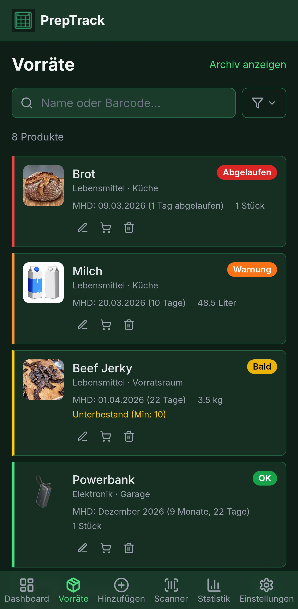
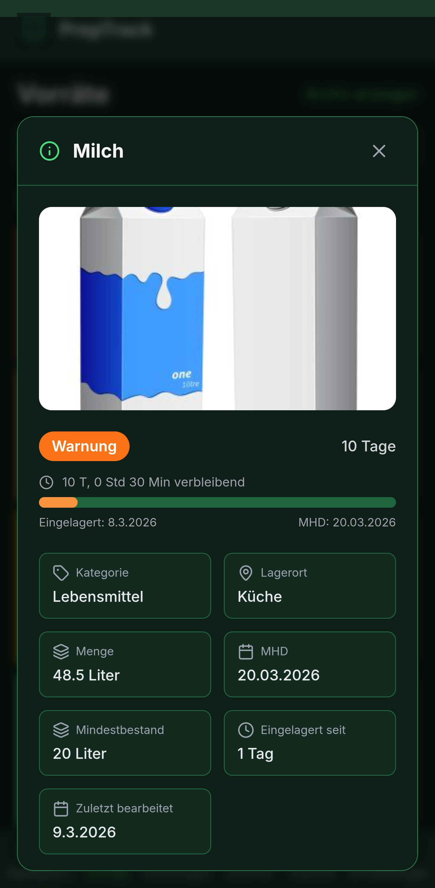
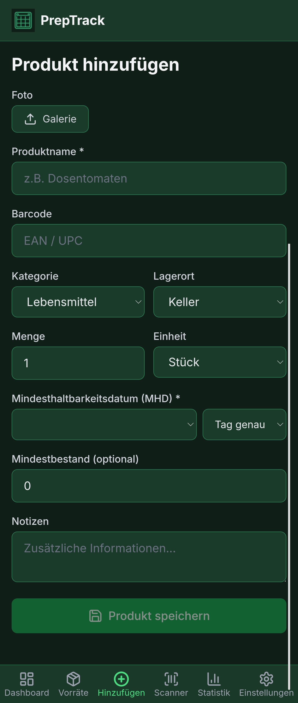
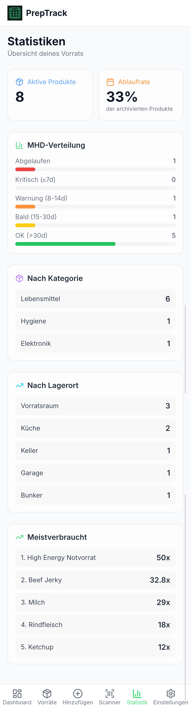
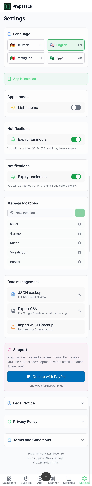
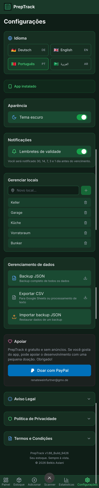

<p align="center">
  
</p>

<h1 align="center">MHD-Inventar</h1>

<p align="center">
  <strong>Expiry dates under control. Inventory at a glance.</strong><br>
  <sub>Fristen im Griff. Bestaende im Blick.</sub>
</p>

<p align="center">
  <a href="https://beko2210.github.io/MHD_INVENTOY/"></a>
</p>

<p align="center">
  <a href="https://github.com/BEKO2210/MHD_INVENTOY/actions/workflows/deploy.yml"></a>
  <a href="https://github.com/BEKO2210/MHD_INVENTOY/releases"></a>
  <a href="https://github.com/BEKO2210/MHD_INVENTOY/blob/main/LICENSE"></a>
  <a href="https://github.com/BEKO2210/MHD_INVENTOY/stargazers"></a>
  <a href="https://github.com/BEKO2210/MHD_INVENTOY/issues"></a>
  <a href="https://github.com/BEKO2210/MHD_INVENTOY/network/members"></a>
</p>

<p align="center">
  <a href="#-features">Features</a>&nbsp;&bull;
  <a href="#-product-categories--standards">Categories</a>&nbsp;&bull;
  <a href="#-screenshots">Screenshots</a>&nbsp;&bull;
  <a href="#-tech-stack">Tech Stack</a>&nbsp;&bull;
  <a href="#-getting-started">Getting Started</a>&nbsp;&bull;
  <a href="#-licensing">Licensing</a>
</p>

<p align="center">
  <a href="#-deutsch">Deutsche Version weiter unten</a>
</p>

---

## What is MHD-Inventar?

MHD-Inventar is a **professional, offline-first Progressive Web App** for enterprise-grade expiry date management and inventory tracking. Designed for companies that need to monitor shelf life, compliance deadlines, and safety-relevant expiration dates across all product categories — from food and pharmaceuticals to fire extinguishers, chemicals, PPE, and automotive fluids.

> **Built for businesses, facility managers, quality assurance teams, and compliance officers who need reliable, standards-compliant inventory tracking.**

MHD-Inventar supports **15 product categories**, each mapped to the relevant **ISO/DIN/EU norms**, ensuring your organization stays compliant and audit-ready at all times. All data remains on-device — no cloud dependency, no downtime risk.

---

## Key Advantages for Businesses

- **Regulatory Compliance** — Each category includes references to applicable ISO, DIN, EU, and GHS standards
- **Zero Downtime** — Fully offline-capable; works in warehouses, workshops, and field locations without internet
- **No Cloud Risk** — All data stored locally in IndexedDB; no third-party data processing
- **Multi-Device Deployment** — Install as PWA on tablets, smartphones, and desktop workstations
- **Audit-Ready Exports** — JSON backup and CSV export with proper encoding for Excel/ERP integration
- **Multi-Language** — German (default), English, Portuguese, and Arabic for international teams

---

## Features

| Feature | Description |
|---------|-------------|
| **Barcode Scanner** | Scan barcodes with device camera. Auto-lookup via Open Food Facts API. Duplicate detection prevents double entries. |
| **Product Management** | Name, category (15 categories), location, quantity, unit, expiry date (day/month/year precision), photo, notes, ISO/DIN norm references. |
| **Expiry Tracking** | Color-coded status system: Red (expired/critical), Orange (warning), Yellow (approaching), Green (OK). |
| **Dashboard** | StatRing visualization, expiry distribution bar, urgent products overview, category breakdown, low-stock alerts. |
| **Local Notifications** | Automated reminders 30, 14, 7, 3, and 1 day before expiry. No external push servers required. |
| **Storage Locations** | Create and manage custom storage locations (warehouses, shelves, vehicles, buildings). 8 defaults included. |
| **Consumption Log** | Track products as consumed, expired, or disposed. Historical statistics for reporting. |
| **Data Export** | JSON backup (complete dataset) and CSV export (Excel/Google Sheets/ERP compatible with BOM encoding). |
| **Data Import** | Restore from backup with automatic duplicate detection (name + expiry + location matching). |
| **Offline-First** | Fully functional without internet. All data in IndexedDB. Service Worker caches all assets. |
| **Installable PWA** | Deploy as native-like app on Android, iOS, and Desktop. No app store required. |
| **Dark & Light Mode** | Professional dark theme by default. Light theme available for bright environments. |
| **Multi-Language** | German, English, Portuguese, and Arabic with in-app language switcher. |

---

## Product Categories & Standards

MHD-Inventar supports **15 specialized product categories**, each linked to the applicable regulatory standards:

| Category | Applicable Standards |
|----------|---------------------|
| **Lebensmittel (Food)** | ISO 22000, HACCP |
| **Getraenke (Beverages)** | EU-VO 178/2002 |
| **Medizin & Pharma** | ISO 15223, DIN EN ISO 11607 |
| **Kosmetik & Hygiene** | EU-VO 1223/2009 |
| **Chemikalien & Gefahrstoffe** | GHS/CLP-VO 1272/2008 |
| **Kfz-Betriebsstoffe** | DOT 3/4/5.1, DIN 51502 |
| **Batterien & Akkus** | IEC 60086, EU-VO 2023/1542 |
| **Elektronik & Technik** | RoHS, WEEE |
| **Reinigungsmittel** | CLP-VO, Biozid-VO |
| **Schmierstoffe & Oele** | DIN 51502, ISO 6743 |
| **Brandschutz & Loeschmittel** | DIN EN 3, ISO 7010 |
| **Erste Hilfe & Verband** | DIN 13157, DIN 13169 |
| **PSA & Arbeitsschutz** | EU-VO 2016/425 |
| **Baustoffe & Klebstoffe** | DIN EN 197 |
| **Sonstiges** | User-defined |

---

## Screenshots

<details>
<summary><strong>Dark Mode</strong></summary>
<br>
<p align="center">
  
  &nbsp;
  
  &nbsp;
  
</p>
<p align="center">
  
  &nbsp;
  
  &nbsp;
  
</p>
</details>

<details open>
<summary><strong>Light Mode</strong></summary>
<br>
<p align="center">
  
  &nbsp;
  
  &nbsp;
  
</p>
<p align="center">
  
  &nbsp;
  
  &nbsp;
  
</p>
</details>

<details>
<summary><strong>Language Switcher (Multi-Language)</strong></summary>
<br>
<p align="center">
  
  &nbsp;
  
</p>
</details>

---

## Tech Stack

| Category | Technology | Purpose |
|----------|-----------|---------|
| **Framework** | React 18 + TypeScript | Interactive SPA with type safety |
| **Bundler** | Vite 6 | Fast dev server, optimized production builds |
| **Styling** | Tailwind CSS 3 | Utility-first CSS, dark mode support |
| **State** | Zustand | Lightweight, performant state management |
| **Database** | Dexie.js (IndexedDB) | Offline-first, reactive queries, local persistence |
| **PWA** | vite-plugin-pwa (Workbox) | Auto-update, runtime caching, offline support |
| **Scanner** | @zxing/browser | Barcode/EAN recognition via device camera |
| **i18n** | react-i18next | Multi-language support (DE/EN/PT/AR) |
| **Icons** | Lucide React | Consistent, lightweight SVG icons |
| **Animation** | Framer Motion | Smooth UI transitions |
| **API** | Open Food Facts | Product database for barcode lookup |
| **CI/CD** | GitHub Actions | Automated testing and deployment |
| **Testing** | Vitest | Unit tests (59 tests) |

---

## Getting Started

### Prerequisites

- [Node.js](https://nodejs.org/) 20.x or higher
- npm 9+

### Installation

```bash
# Clone the repository
git clone https://github.com/BEKO2210/MHD_INVENTOY.git
cd MHD_INVENTOY

# Install dependencies
npm install

# Start development server
npm run dev
```

The app is available at `http://localhost:5173`.

### Build & Test

```bash
npm run build      # Production build (tsc + vite)
npm run preview    # Preview production build locally
npm run test       # Run all tests (Vitest)
npx tsc --noEmit   # Type check without building
```

### Deploy (GitHub Pages)

1. Push to your GitHub repository
2. Go to **Settings > Pages** and set source to **GitHub Actions**
3. Every push to `main` triggers automatic deployment

---

## PWA Installation

MHD-Inventar can be deployed as a native-like application on company devices without any app store:

<table>
<tr>
<td width="33%">

**Android (Chrome)**
1. Open app in browser
2. Tap "Install" banner or Menu > "Install app"

</td>
<td width="33%">

**iOS (Safari)**
1. Open app in browser
2. Tap Share button
3. Select "Add to Home Screen"

</td>
<td width="33%">

**Desktop (Chrome/Edge)**
1. Open app in browser
2. Click install icon in the address bar

</td>
</tr>
</table>

---

## Data Privacy & Security

MHD-Inventar is designed with enterprise data security in mind:

- **All data stored locally** on the device (IndexedDB). No cloud servers. No user accounts. No data leaves the device.
- **No tracking.** No analytics. No cookies. No advertising. No third-party data sharing.
- **External service:** Only the Open Food Facts API is contacted during barcode scans (open-source, non-profit). Only the barcode number is transmitted.
- **Notifications** are generated locally on-device. No push tokens sent to external servers.
- **Full data sovereignty:** Export and import data anytime. Delete via browser settings. Your data, your control.

---

## Project Structure

```
src/
├── components/           UI Components
│   ├── Dashboard.tsx         Main overview with stats and alerts
│   ├── ProductList.tsx       Inventory list with search and filters
│   ├── ProductForm.tsx       Add/edit form with draft persistence
│   ├── BarcodeScanner.tsx    Camera barcode scanner with API lookup
│   ├── Settings.tsx          Configuration, language, export/import
│   ├── Statistics.tsx        Consumption and expiry statistics
│   ├── Navigation.tsx        Bottom navigation bar
│   ├── StatRing.tsx          SVG ring chart component
│   ├── OfflineBanner.tsx     Offline indicator
│   ├── PWAInstallPrompt.tsx  PWA install prompt
│   └── ErrorBoundary.tsx     Error fallback UI
├── hooks/                Custom React Hooks
│   ├── useDarkMode.ts        Dark/light mode toggle
│   ├── useOnlineStatus.ts    Online/offline detection
│   └── usePWAInstall.ts      PWA installation
├── i18n/                 Internationalization
│   ├── i18n.ts               i18next configuration
│   └── locales/              Translation files (de, en, pt, ar)
├── lib/                  Business Logic
│   ├── db.ts                 Dexie.js database, CRUD, export/import
│   ├── utils.ts              Expiry calculation, formatting, barcode lookup
│   ├── utils.test.ts         Unit tests (59 tests)
│   └── notifications.ts      Local notification scheduling
├── store/                State Management
│   └── useAppStore.ts        Zustand store (navigation, filters, state)
├── types/                TypeScript Types
│   └── index.ts              Product, Category, Units, Norms, etc.
├── App.tsx               Main component with routing
├── main.tsx              Entry point
└── sw-handler.ts         Service Worker update handler
```

---

## Security

If you discover a security vulnerability, please report it responsibly. See [SECURITY.md](SECURITY.md) for details.

---

## Licensing & Contact

MHD-Inventar is a commercial B2B product licensed to businesses and organizations.

For licensing inquiries, volume pricing, custom deployments, or enterprise support, please contact:

**Belkis Aslani**
GitHub: [@BEKO2210](https://github.com/BEKO2210)
Repository: [github.com/BEKO2210/MHD_INVENTOY](https://github.com/BEKO2210/MHD_INVENTOY)

> For feature requests and bug reports, please use the [issue tracker](https://github.com/BEKO2210/MHD_INVENTOY/issues).

---

## Development

This project was developed with the assistance of **Claude Code** (Anthropic, Model: claude-opus-4-6).

Every function was controlled through targeted instructions, every bug was analyzed and systematically fixed, every feature was implemented and tested step by step. The human sets the direction, the AI executes.

> See [CHANGELOG.md](CHANGELOG.md) for the complete change history.

---

## License

```
Copyright 2026 Belkis Aslani

Licensed under the Apache License, Version 2.0 (the "License");
you may not use this file except in compliance with the License.
You may obtain a copy of the License at

    http://www.apache.org/licenses/LICENSE-2.0
```

See [LICENSE](LICENSE) for the full license text.

---

---

<h1 align="center" id="-deutsch">Deutsch</h1>

<p align="center">
  <strong>Fristen im Griff. Bestaende im Blick.</strong>
</p>

---

## Was ist MHD-Inventar?

MHD-Inventar ist eine **professionelle, Offline-first Progressive Web App** fuer unternehmensweites MHD- und Bestandsmanagement. Entwickelt fuer Unternehmen, die Mindesthaltbarkeitsdaten, Compliance-Fristen und sicherheitsrelevante Ablaufdaten ueber alle Produktkategorien hinweg ueberwachen muessen — von Lebensmitteln und Pharmazeutika ueber Brandschutzmittel und Chemikalien bis hin zu PSA und Kfz-Betriebsstoffen.

> **Entwickelt fuer Unternehmen, Facility Manager, Qualitaetssicherungsteams und Compliance-Beauftragte, die zuverlaessiges, normenkonformes Bestandsmanagement benoetigen.**

MHD-Inventar unterstuetzt **15 Produktkategorien**, jeweils mit Referenzen zu den relevanten **ISO/DIN/EU-Normen**, damit Ihre Organisation jederzeit compliant und audit-bereit bleibt.

---

## Vorteile fuer Unternehmen

- **Regulatorische Compliance** — Jede Kategorie mit Referenzen zu ISO-, DIN-, EU- und GHS-Normen
- **Kein Ausfallrisiko** — Vollstaendig offline-faehig; funktioniert in Lagern, Werkstaetten und im Aussendienst ohne Internet
- **Kein Cloud-Risiko** — Alle Daten lokal in IndexedDB gespeichert; keine Drittanbieter-Datenverarbeitung
- **Multi-Device-Einsatz** — Installierbar als PWA auf Tablets, Smartphones und Desktop-Arbeitsplaetzen
- **Audit-feste Exporte** — JSON-Backup und CSV-Export mit korrekter Kodierung fuer Excel/ERP-Integration
- **Mehrsprachig** — Deutsch (Standard), Englisch, Portugiesisch und Arabisch fuer internationale Teams

---

## Funktionen

| Funktion | Beschreibung |
|----------|-------------|
| **Barcode-Scanner** | Barcode scannen mit der Kamera. Automatische Erkennung via Open Food Facts API. Duplikat-Warnung bei Doppeleintraegen. |
| **Produktverwaltung** | Name, Kategorie (15 Kategorien), Lagerort, Menge, Einheit, MHD (Tag/Monat/Jahr), Foto, Notizen, ISO/DIN-Normreferenzen. |
| **MHD-Tracking** | Farbcodiertes Statussystem: Rot (abgelaufen/kritisch), Orange (Warnung), Gelb (bald faellig), Gruen (OK). |
| **Dashboard** | StatRing-Visualisierung, MHD-Verteilung, dringende Produkte, Kategorieuebersicht, Unterbestand-Warnungen. |
| **Benachrichtigungen** | Automatische Erinnerungen 30, 14, 7, 3 und 1 Tag vor Ablauf. Keine externen Push-Server erforderlich. |
| **Lagerorte** | Eigene Lagerorte anlegen und verwalten (Lager, Regale, Fahrzeuge, Gebaeude). 8 Standard-Lagerorte vorinstalliert. |
| **Verbrauchsprotokoll** | Produkte als verbraucht, abgelaufen oder entsorgt erfassen. Historische Statistiken fuer Berichte. |
| **Daten-Export** | JSON-Backup (vollstaendiger Datensatz) und CSV-Export (Excel/ERP-kompatibel mit BOM-Kodierung). |
| **Daten-Import** | Backup wiederherstellen mit automatischer Duplikat-Erkennung (Name + MHD + Lagerort). |
| **Offline-First** | Vollstaendig offline nutzbar. Alle Daten in IndexedDB. Service Worker cached alle Assets. |
| **Installierbar** | Als PWA auf Android, iOS und Desktop installierbar — ohne App Store. |
| **Dark & Light Mode** | Professionelles dunkles Design als Standard. Helles Design fuer helle Arbeitsumgebungen. |
| **Mehrsprachig** | Deutsch, Englisch, Portugiesisch und Arabisch mit Sprachumschalter in den Einstellungen. |

---

## Produktkategorien & Normen

MHD-Inventar unterstuetzt **15 spezialisierte Produktkategorien**, jeweils verknuepft mit den anwendbaren regulatorischen Standards:

| Kategorie | Anwendbare Normen |
|-----------|------------------|
| **Lebensmittel** | ISO 22000, HACCP |
| **Getraenke** | EU-VO 178/2002 |
| **Medizin & Pharma** | ISO 15223, DIN EN ISO 11607 |
| **Kosmetik & Hygiene** | EU-VO 1223/2009 |
| **Chemikalien & Gefahrstoffe** | GHS/CLP-VO 1272/2008 |
| **Kfz-Betriebsstoffe** | DOT 3/4/5.1, DIN 51502 |
| **Batterien & Akkus** | IEC 60086, EU-VO 2023/1542 |
| **Elektronik & Technik** | RoHS, WEEE |
| **Reinigungsmittel** | CLP-VO, Biozid-VO |
| **Schmierstoffe & Oele** | DIN 51502, ISO 6743 |
| **Brandschutz & Loeschmittel** | DIN EN 3, ISO 7010 |
| **Erste Hilfe & Verband** | DIN 13157, DIN 13169 |
| **PSA & Arbeitsschutz** | EU-VO 2016/425 |
| **Baustoffe & Klebstoffe** | DIN EN 197 |
| **Sonstiges** | Benutzerdefiniert |

---

## Screenshots

<details open>
<summary><strong>Dunkler Modus</strong></summary>
<br>
<p align="center">
  
  &nbsp;
  
  &nbsp;
  
</p>
<p align="center">
  
  &nbsp;
  
  &nbsp;
  
</p>
</details>

<details>
<summary><strong>Heller Modus</strong></summary>
<br>
<p align="center">
  
  &nbsp;
  
  &nbsp;
  
</p>
<p align="center">
  
  &nbsp;
  
  &nbsp;
  
</p>
</details>

<details>
<summary><strong>Sprachumschalter (Mehrsprachig)</strong></summary>
<br>
<p align="center">
  
  &nbsp;
  
</p>
</details>

---

## Installation & Start

```bash
# Repository klonen
git clone https://github.com/BEKO2210/MHD_INVENTOY.git
cd MHD_INVENTOY

# Dependencies installieren
npm install

# Entwicklungsserver starten
npm run dev
```

Die App ist dann unter `http://localhost:5173` verfuegbar.

### Build & Tests

```bash
npm run build      # Production Build (tsc + vite)
npm run preview    # Build lokal testen
npm run test       # Tests ausfuehren (Vitest, 59 Tests)
npx tsc --noEmit   # Type-Check ohne Build
```

---

## PWA Installation

MHD-Inventar kann als native App auf Firmengeraeten installiert werden — ohne App Store:

<table>
<tr>
<td width="33%">

**Android (Chrome)**
1. App im Browser oeffnen
2. Banner "Installieren" antippen oder Menue > "App installieren"

</td>
<td width="33%">

**iOS (Safari)**
1. App im Browser oeffnen
2. Teilen-Button antippen
3. "Zum Home-Bildschirm" waehlen

</td>
<td width="33%">

**Desktop (Chrome/Edge)**
1. App im Browser oeffnen
2. Installieren-Icon in der Adressleiste klicken

</td>
</tr>
</table>

---

## Datenschutz & Sicherheit

- **Alle Daten lokal** auf dem Geraet (IndexedDB). Keine Cloud-Server. Keine Benutzerkonten. Keine Daten verlassen das Geraet.
- **Kein Tracking.** Keine Analytics. Keine Cookies. Keine Werbung. Keine Datenweitergabe an Dritte.
- **Externer Dienst:** Nur die Open Food Facts API wird beim Barcode-Scan kontaktiert (Open Source, gemeinnuetzig). Es wird nur die Barcode-Nummer uebermittelt.
- **Benachrichtigungen** werden lokal auf dem Geraet erzeugt. Keine Push-Tokens an externe Server.
- **Volle Datenhoheit:** Daten jederzeit exportieren/importieren. Loeschen ueber Browser-Einstellungen.

---

## Lizenzierung & Kontakt

MHD-Inventar ist ein kommerzielles B2B-Produkt, lizenziert fuer Unternehmen und Organisationen.

Fuer Lizenzanfragen, Volumenpreise, individuelle Deployments oder Enterprise-Support kontaktieren Sie:

**Belkis Aslani**
GitHub: [@BEKO2210](https://github.com/BEKO2210)
Repository: [github.com/BEKO2210/MHD_INVENTOY](https://github.com/BEKO2210/MHD_INVENTOY)

> Fuer Feature-Requests und Bug-Reports nutzen Sie bitte den [Issue-Tracker](https://github.com/BEKO2210/MHD_INVENTOY/issues).

---

## Entwicklung

Dieses Projekt wurde mit Unterstuetzung von **Claude Code** (Anthropic, Modell: claude-opus-4-6) entwickelt.

Jede Funktion wurde durch gezielte Anweisungen gesteuert, jeder Bug wurde analysiert und systematisch behoben, jedes Feature wurde Schritt fuer Schritt implementiert und getestet. Der Mensch gibt die Richtung vor, die KI setzt um.

> Siehe [CHANGELOG.md](CHANGELOG.md) fuer die vollstaendige Aenderungshistorie.

---

## Lizenz

```
Copyright 2026 Belkis Aslani

Licensed under the Apache License, Version 2.0 (the "License");
you may not use this file except in compliance with the License.
You may obtain a copy of the License at

    http://www.apache.org/licenses/LICENSE-2.0
```

Siehe [LICENSE](LICENSE) fuer den vollstaendigen Lizenztext.

---

<p align="center">
  Engineered in Germany
</p>
